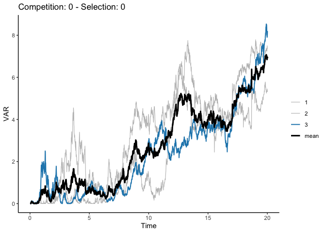

<!-- README.md is generated from README.Rmd. Please edit that file -->

# CAMPSITE

<!-- badges: start -->

[](https://lifecycle.r-lib.org/articles/stages.html#experimental)
<!-- badges: end -->

The goal of CAMPSITE is to run simulation using the Competition And
Multiple-Peak Selection Integrated Trait Evolution (CAMPSITE) model in
R.

## Installation

You can install the development version of CAMPSITE like so:

``` r
remotes::install_github("annakrystalli/CAMPSITE")
```

## Example

This is a basic example which shows you how to solve a common problem:

``` r
library(CAMPSITE)
## basic example code
set.seed(20220327)
```

## Create parameter object

Creates default parameter object. Supply parameter values as arguments
to change

``` r
pars <- cs_pars(lambda1 = 0.3)
```

## Run simulation

``` r
res <- cs_simulate(pars, ou = list(opt = 0, alpha4 = 0), root.value = 0, age.max = 10, 
                          age.ext = NULL, step_size = 0.01, bounds = c(-Inf, Inf), 
                          plot = TRUE, ylims = NULL, full_results = TRUE) 
#> ℹ Simulation initiated 
#> ✓ Simulation complete 
#> ✓ Building tree complete
```


## Plot simulation

The default plotting method for the simulation results object plots the
simulated evolution of lineages through trait space

``` r
res2 <- cs_simulate(pars = cs_pars(alpha1 = 0.1), ou = list(opt = NULL, alpha4 = NULL), root.value = 0, age.max = 10, 
                    age.ext = NULL, step_size = 0.01, bounds = c(-Inf, Inf), 
                    plot = FALSE, ylims = NULL, full_results = TRUE) 
#> Warning: no OU parameters supplied; continuing without OU process
#> ℹ Simulation initiated 
#> ✓ Simulation complete 
#> ✓ Building tree complete
```

``` r
plot(res2, incipient_col = harrypotter::hp(n = 6, option = "Ravenclaw")[6])
```


## Summarising results

``` r
res_summaries <- cs_summarise_results(list(res, res2))
```

## Plotting means of multiple selection x competion combinations

``` r
plot_tip_trait_distribution(res_summaries)
```


``` r
plot_var_vs_time(res_summaries, variable = "VAR", time = "int")
```


``` r

plot_var_vs_time(res_summaries, variable = "VAR", time = "step")
```


``` r
# plot individual result
plot_var_vs_time(cs_summarise_results(res), variable = "VAR", time = "step")
```


``` r
plot_var_vs_time(res_summaries, variable = "MNND", time = "step")
```


``` r
plot_var_vs_time(res_summaries, variable = "VNND", time = "step")
```


## Simulating over parameter space

### Simulate

The following code runs the replicate (3 for each combination)
simulations across all combination of selection and competition values
0, 0.025 and 0.1 and saves the replicates for each combination in an
appropriately named file in subdirectory `sims/` of the working
directory.

``` r
max_rep <- 3
selection_values <- c(0, 0.025, 0.1)
competition_values <- c(0, 0.025, 0.1)

params_grid <- tidyr::crossing(selection_values, competition_values)

future.apply::future_mapply(FUN = 
                              function(selection, competition, max_rep, age.max, ensure_valid, plot) {
                                cs_simulate_reps(pars = cs_pars(alpha1 = competition, 
                                                                alpha2 = competition,
                                                                alpha3 = selection),
                                                 ou = list(opt = 0, alpha4 = selection),
                                                 max_rep = max_rep, age.max = age.max,
                                                 out_filepath = file.path("sims", 
                                                                          paste0("comp-", competition, 
                                                                                 "_selec-", selection, 
                                                                                 "_reps-", max_rep, 
                                                                                 "_", Sys.Date(),
                                                                                 ".rds")),
                                                 ensure_valid = ensure_valid, plot = plot)
                              }, 
                            competition = params_grid$competition_values, 
                            selection = params_grid$selection_values, 
                            MoreArgs = list(
                              max_rep = max_rep,
                              age.max = 20,
                              ensure_valid = TRUE,
                              plot = FALSE),
                            future.seed=TRUE)
```

### Summarise

Summarise all simluation results

``` r
summaries <- list.files(file.path("sims"), full.names = TRUE) %>%
  future.apply::future_lapply(FUN = function(x){
    readRDS(x) %>% cs_summarise_results
  }) %>% unlist(recursive = FALSE)
```

## Plotting means and replicates of a single selection x competion combinations

### Load and summarise replicates of a single selection x competion combinations

``` r
rep_filepath <- list.files(system.file("sims", package = "CAMPSITE"), 
                        full.names = TRUE)[1]
rep_filepath
#> [1] "/Library/Frameworks/R.framework/Versions/4.1/Resources/library/CAMPSITE/sims/comp0_selec0_reps3.rds"

rep_summaries <- rep_filepath %>%
  future.apply::future_lapply(FUN = function(x){
    readRDS(x) %>% cs_summarise_results }) %>% 
  unlist(recursive = FALSE)
```

``` r
plot_tip_trait_distribution_replicates(rep_summaries)
```


``` r
plot_var_vs_time_replicates(rep_summaries, variable = "VAR")
```



``` r

plot_var_vs_time_replicates(rep_summaries, variable = "MNND")
```


``` r
plot_var_vs_time_replicates(rep_summaries, variable = "VNND")
```


``` r
plot_diversification_replicates(rep_summaries)
```


``` r
plot_lineages_through_time_replicates(rep_summaries)
```


